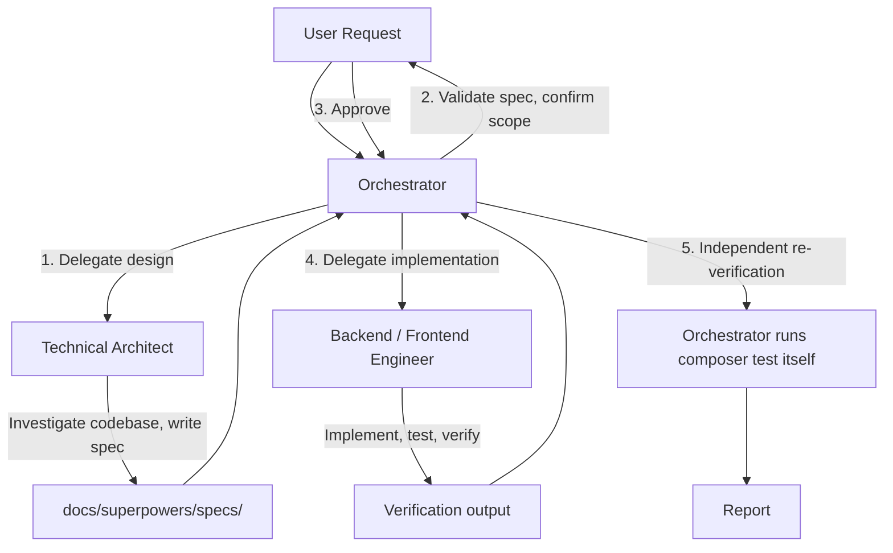

# Multi-Agent Development Workflow (Spec-Driven SDLC)

This project follows a **Spec-Driven Software Development Life Cycle**. The
root agent in the active session acts as **Master Orchestrator**. It coordinates
the lifecycle, validates handovers, runs verification, and delegates
specialised sub-tasks through the **Direct Injection Proxy Method** defined
below.

> [!IMPORTANT]
> **CRITICAL ORCHESTRATION RULE**
>
> When delegating to a custom subagent you MUST use the Direct Injection Proxy
> Method:
>
> 1. Read the subagent's exact instruction file from the workspace, e.g.
>    `.agents/agents/{agent_name}/agent.md`. If the workspace copy is absent,
>    read the global copy at
>    `~/.gemini/configs/agents/{agent_name}/agent.md`.
> 2. **ALWAYS set `TypeName: "self"`.** This makes the subagent inherit the full
>    parent capability set — write tools (`write_to_file`,
>    `replace_file_content`) and command execution (`run_command`) — so it can
>    write code and run tests itself instead of returning patches as prose.
> 3. Set `Role` to the descriptive role name, e.g. `Role: "Technical Architect"`.
> 4. Inject the **entire verbatim contents** of the agent markdown into the
>    `Prompt` argument, then append the specific task instructions.
>
> This rule exists to stop the runtime from synthesising its own subagent
> instructions in place of the static definitions in this repository.

## Agent Registry

| Agent | File | Mandate |
| :--- | :--- | :--- |
| Technical Architect | `.agents/agents/blatui-architect/agent.md` | Investigate, design, specify. Writes no production code. |
| Backend Engineer | `.agents/agents/blatui-backend-engineer/agent.md` | Implement PHP against an approved spec, with tests and verification. |
| Frontend Engineer | `.agents/agents/blatui-frontend-engineer/agent.md` | Author Blade / Tailwind / Alpine view-layer work with native escaping. |

## Workflow



### Phase 1 — Design

The Orchestrator delegates to the Technical Architect. The Architect reads the
codebase, enumerates the **full** surface of the change (production files, tests,
call sites, views, consumers), and writes a specification under
`docs/superpowers/specs/`.

The Architect must distinguish tests that assert *correct behaviour* from tests
that *encode a defect*. A defect-encoding test must be inverted before the
production fix lands, otherwise the suite goes red mid-implementation and the
Engineer cannot tell a real regression from the intended fix.

### Phase 2 — Review

The Orchestrator reads the specification and validates it against `AGENTS.md`
before delegating implementation. Ambiguity is resolved here, not during
implementation.

### Phase 3 — Implementation

The Orchestrator delegates to the Backend or Frontend Engineer, passing the
specification path and the explicit scope. The Engineer implements surgically,
inverts only the tests the specification named, adds the tests the
specification named, and runs the verification commands.

### Phase 4 — Verification (non-negotiable)

**The Orchestrator re-runs verification itself.** It never accepts an Engineer's
claim that the suite is green. Minimum gate:

```bash
composer test    # phpstan 0 errors, pint clean, pest green, 100% type coverage
```

Plus the task-specific structural checks the specification defines, for example
`grep -rn '{!!' resources/views` returning no output.

An Engineer report is evidence, not proof.

### Phase 5 — Delivery

- One commit per phase, with a message that states what changed.
- Feature work lands on a feature branch. Merging to `main` is a separate,
  explicit step that re-runs the full gate.
- Update `AGENTS.md` and documentation only after the behaviour is verified and
  merged.

## Division of Labour

| Concern | Architect | Engineer | Orchestrator |
| :--- | :---: | :---: | :---: |
| Investigate & enumerate | ✅ | | verify |
| Decide the design | ✅ | | approve |
| Write production code | ❌ | ✅ | review |
| Write / invert tests | specify only | ✅ | review |
| Run `composer test` | | ✅ | ✅ independently |
| Merge to `main` | | ❌ | ✅ |
| Report status to the user | | | ✅ |

## Invariants

- Never delegate implementation before a specification exists.
- Never let a subagent expand its own scope.
- Never mark work complete on a subagent's say-so.
- Never leave a partially applied change (a deleted class still referenced, a
  method removed with live call sites) — finish the step or revert it.
- When a task touches the rendering layer, `AGENTS.md`'s rendering contract is
  binding: PHP classes hold state, Blade owns markup, `{{ }}` escapes,
  `{!! !!}` is forbidden.
