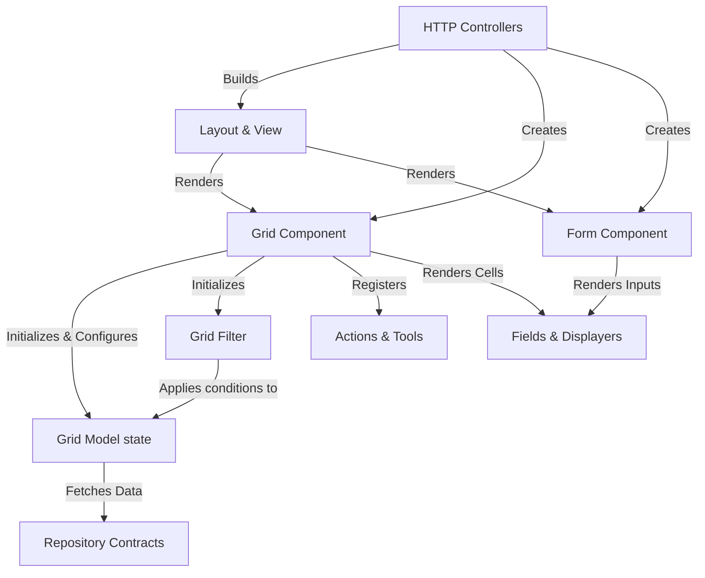

# Architecture Overview

This document provides a high-level overview of the `blatui-admin` package architecture, derived directly from the codebase's knowledge graph.

## Codebase Statistics
- **Files**: 211
- **Symbols**: 1862
- **Execution Flows (Processes)**: 149

## Functional Areas (Clusters)

The codebase is organized into several key functional clusters (sorted by symbol count):

| Cluster | Symbols | Cohesion | Description |
| :--- | :--- | :--- | :--- |
| **Grid** | 137 | 84% | Core data table and list rendering logic |
| **Filter** | 45 | 93% | Search and filtering for grids |
| **Layout** | 40 | 90% | Page layout and view composition |
| **Controllers** | 35 | 68% | HTTP request handling and resource routing |
| **Form** | 33 | 83% | Form rendering and data mutation |
| **Field** | 25 | 84% | Individual form inputs and grid columns |
| **Actions** | 24 | 90% | Row, batch, and global actions |
| **Exceptions** | 22 | 81% | Domain-specific error handling |
| **Contracts** | 22 | 82% | Interfaces defining package boundaries |
| **Repositories** | 12 | 83% | Data access abstractions |

*(Other modules include Middleware, Displayers, Models, Resources, Traits, Tools, Support, and Commands)*

## Key Execution Flows

The most heavily utilized paths in the system involve the `Grid` component preparing data for rendering. The top 5 execution flows demonstrate how the Grid interacts with the Model and Filter layers:

1. **`__toString → Model`**
   `Grid::__toString()` ➔ `render()` ➔ `rows()` ➔ `model()` ➔ `initModel()` ➔ `Grid\Model::getModel()` ➔ `Contracts\Repository::model()`
2. **`ToResponse → Model`**
   `Grid::toResponse()` ➔ `render()` ➔ `rows()` ➔ `model()` ➔ `initModel()` ➔ `Grid\Model::getModel()` ➔ `Contracts\Repository::model()`
3. **`ToResponse → Paginate`**
   `Grid::toResponse()` ➔ `render()` ➔ `rows()` ➔ `model()` ➔ `initModel()` ➔ `Grid::paginate()` ➔ `Grid\Model::paginate()`
4. **`ToResponse → SetModel`**
   `Grid::toResponse()` ➔ `render()` ➔ `rows()` ➔ `model()` ➔ `initModel()` ➔ `Grid\Filter::setModel()`
5. **`ToResponse → SetFilter`**
   `Grid::toResponse()` ➔ `render()` ➔ `rows()` ➔ `model()` ➔ `initModel()` ➔ `Grid\Model::setFilter()`

## Architecture Diagram

The following diagram illustrates the relationship between the primary components during a typical data-rendering lifecycle.

